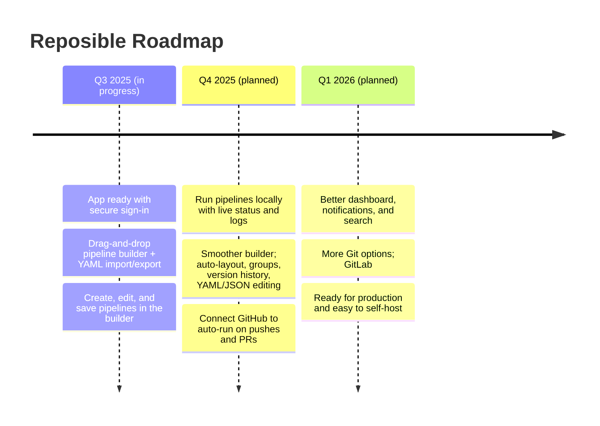

# Reposible Roadmap

## MVP Focus — Visual Pipeline Builder

The MVP centers on a drag-and-drop visual pipeline builder. Users build end-to-end pipelines on a canvas (nodes and connections), with round-trip import/export to YAML.

## Visual roadmap

### Core objectives for MVP:

- Visual builder with pan/zoom, drag-and-drop steps, draw valid connections, and edit step settings in place.
- One pipeline format (version 0) we validate with Zod. JSON is the source; YAML converts to and from it without losing info.
- Import YAML into the canvas and export it back to YAML with nothing lost (including step order).

## Q3 2025 — MVP: Visual Builder Foundation

### Goals

- ✅ App ready with secure sign-in
- ✅ Drag-and-drop pipeline builder + YAML import/export
- ✅ Create, edit, and save pipelines in the builder

## Q4 2025 — Local Runs, Smoother Builder, GitHub Auto-runs

### Goals

- ✅ Run pipelines locally with live status and logs
- ✅ Smoother builder: auto-layout, groups, version history, YAML/JSON editing
- ✅ Connect GitHub to auto-run on pushes and PRs

## Q1 2026 — Dashboard, Notifications, More Git, Self-hosting

### Goals

- ✅ Better dashboard, notifications, and search
- ✅ More Git options: GitLab
- ✅ Ready for production and easy to self-host